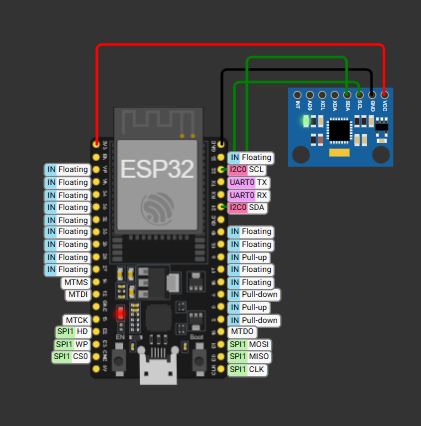
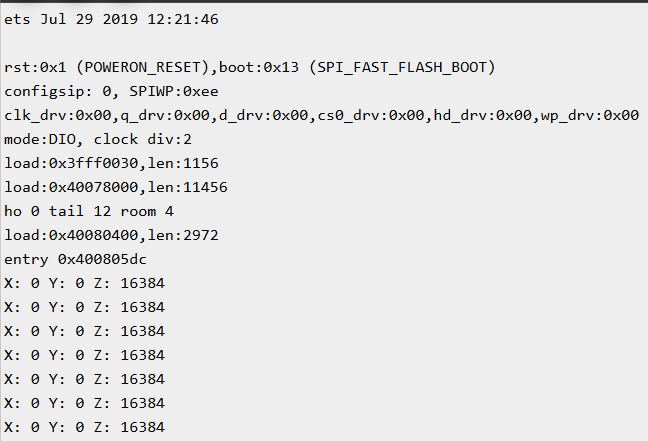

# Vibration fault detection

ECE project: accelerometer (ADXL335/MPU6050) + Arduino/ESP32 + basic ML for detecting vibration faults.

## Status
Day 1 — setup, planning.
Day 2 — Wokwi setup complete, MPU6050 wired and reading live data.
Day 3 — Number systems learned (hex/binary conversion). Started logging sensor data — normal-state readings collected.
## Hardware Learning Roadmap (10-day plan)

Progressive learning to understand the code and wiring in this project, not just copy-paste it.

| Day | Topic | Status |
|---|---|---|
| 1-2 | C basics — loops, functions | ✅ Done |
| 3 | Number systems (decimal/binary/hex) | ✅ Done |
| 4 | Bitwise operators (<<, >>, \|, &) | ⬜ Upcoming |
| 5 | Pointers basics | ⬜ Upcoming |
| 6 | I2C protocol (SCL/SDA, master-slave) | ⬜ Upcoming |
| 7 | Arduino digital I/O | ⬜ Upcoming |
| 8 | Arduino analog I/O (PWM) | ⬜ Upcoming |
| 9 | Full MPU6050 code walkthrough | ⬜ Upcoming |
| 10 | Review + self-written sensor code exercise | ⬜ Upcoming |

**Note:** After college starts, pace slows — foundation completes in 10 days, deeper practice continues weekly/weekends.

**On AI usage:** I use Claude as a learning guide for this project — mostly to break down stuff I don't get yet, like I2C or bitwise operations, and to help me structure this roadmap. But every line of code here I've actually gone through and understood, none of it's copy-pasted. If you check the commit history, you'll see that — it's built step by step, not dumped in one go.

## Live Sensor Output

